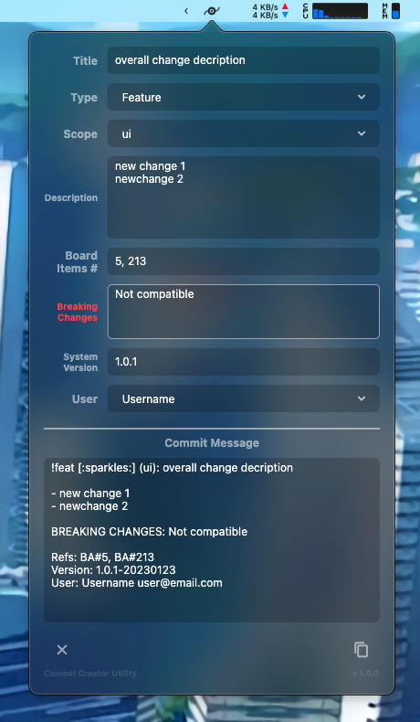

<!--
*** Thanks for using Document My Project. (https://github.com/luisvent/document_my_project) 
*** If you have a suggestion that would make this better, please fork  
*** the repo and create a pull request or simply open an issue.
*** Don't forget to give the project a star!
-->

        
        
        
 

# commit_creator_utility

Simple MACOS menu bar app to generate commit messages based on Conventional Commits Support for Gitmoji

<h4><a href="#-stack-tech">🛠 Stack Tech</a> • <a href="#-acknowledgements">🏆 Acknowledgements</a> • <a href="#-contributing">👏🏻 Contributing</a> • <a href="#-about-the-author">👨🏻‍ About the Author</a> • <a href="#-license">📖 License</a></h4>

<!-- TABLE_CONTENT_PLACEHOLDER -->

## ⭐️ Features

1. **Conventional Commit support**

2. **Gitmoji support**

## 🛠 Stack Tech
- [![Flutter][Flutter-badge]][Flutter-url] - UI framework for iOS, Android & web apps

[Flutter-badge]: https://img.shields.io/badge/Flutter-02569B?style=for-the-badge&logo=flutter
[Flutter-url]: }

## ⚙ ️Setup

### Configuration

Options customization can be done editing the /config/config.json file

## 🏆 Acknowledgements

- [mynameiskenlee]() - Menu bar template

## 👏🏻 Contributing

We welcome contributions from the community! If you would like to contribute to this project, please follow the guidelines below.

### Ways to Contribute

- Report bugs or issues by opening a new issue on our GitHub repository.
- Suggest new features or improvements by opening a new issue on our GitHub repository.
- Contribute code by forking the repository, making changes, and submitting a pull request.

### Contribution Instructions

1. Fork the repository.
2. Create a new branch for your feature or bug fix: `git checkout -b my-feature-branch`.
3. Make the necessary changes and commit them: `git commit -am 'Add my new feature'`.
4. Push your branch to your forked repository: `git push origin my-feature-branch`.
5. Open a pull request against the main repository, describing the changes you made and why they should be merged.
### Contributors

## 👨🏻‍ About the Author

**Luis Ventura**

This project was created by Luis Ventura. Connect with me on [GitHub](https://github.com/luisvent)  to learn more about my projects and professional background.

## 📖 License

This project is licensed under the [MIT License](https://opensource.org/licenses/MIT).

---
v1.0.2

<a href="#readme-top">Top ⬆️</a>

---
 
Built with ❤️ with <a href="https://github.com/luisvent/document_my_project">Document My Project</a>

